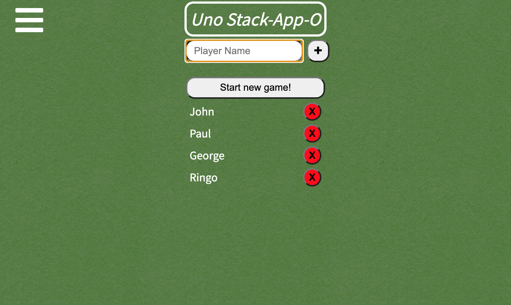
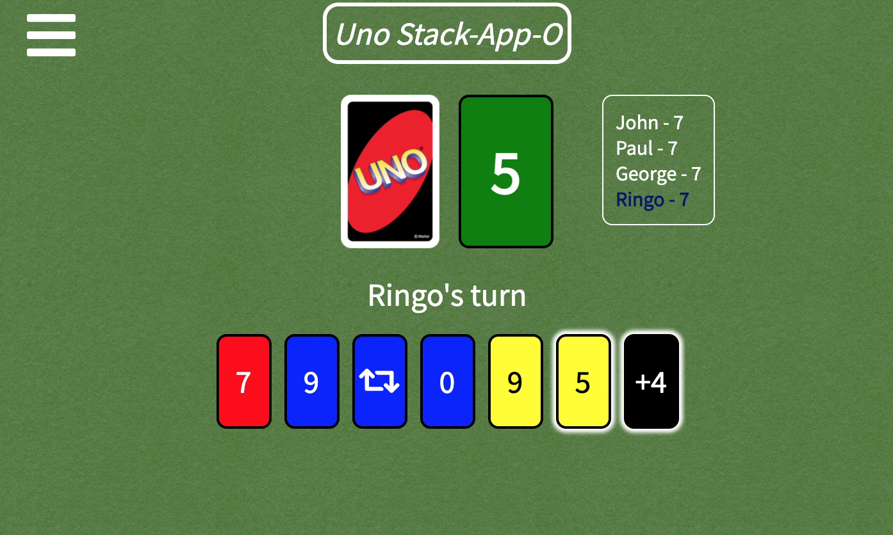

# CodeCards Setup and Gameplay

Refer to the README.md files in both the server and client folders for setup.

Images of app and gameplay below.

# Task:
Create a browser game based on an existing card or dice game. Model and test the game logic and then display it in the browser for a user to interact with.

# MVP:
Create a simple card game modelled after Uno. The game will involve four suits (colours), with each suit containing the numbers 0 through to 9, adding individual card styling to create a visual difference.
This game will exclude any special cards. The game will allow from two to ten players, selected at time of play.

# A user should be able to:

1. Add a minimum of two and a maximum of 10 players to the player list.
2. Be able to distinguish different card types from card styling.
3. Be able to play only the cards in their hand that adhere to the rules of the game.
4. Be able to add to their card total by 'picking up' cards from the draw pile.

# Extensions:

1. Addition of special cards, including skip, reverse, +2, +4, and change colour cards.
2. Add a victory counter defined by player name. To be displayed in a leader board or chart.
3. Add socket.io to make it playable across multiple computers.

# How to play:

1. Click on the menu bar to the left of the screen to access the rules of play.

2. Click on the play button in the centre of the screen and use the form to add players. A minimum of two players must be entered in order bring up the 'Start new game!' button to start the game.

3. The players hand consists of the seven cards at the bottom of the screen. Playable cards have a halo around them. The draw pile is illustrated by the uno card, and the discard pile is to the right of the draw pile. To play your turn, select a card from your hand that matches either the colour or the number of the card that is in the discard pile. If none of your cards can be played, you must click on the draw pile to add a card to your hand, which ends your turn.

4. Special cards consist of '+2', 'Skip', and 'Reverse', each of which can be any colour and follow the same rules of play as the numbered cards. The black special cards consist of '+4' and 'Change Colour', and can be played at any time. Refer to the rules of play to see what each special card does.

5. The game will end when one player manages to play all of their cards. The winner is displayed and a win is added to their total on the leaderboard, accessed by the menu on the left of the screen. You will then have the option to play again which takes you back to the form to add/remove players before playing again.

